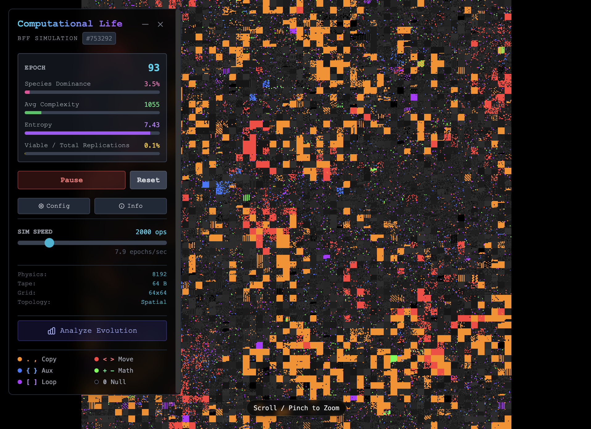

# Computational Life: BFF Simulation

A real-time WebGL simulation visualizing the emergence of self-replicating artificial life, based on the research paper *"Computational Life: How Well-formed, Self-replicating Programs Emerge from Simple Interaction"* (Agüera y Arcas et al., 2024).



## 📄 The Science

This project implements the "BFF" (Brainfuck-derivative) virtual machine and interaction model described in the paper. It demonstrates how complex, self-replicating programs can spontaneously emerge from high-entropy random noise without an explicit fitness function.

**Read the original paper:** [arXiv:2406.19108](https://arxiv.org/abs/2406.19108)

### Key Concepts

1.  **Substrate (BFF Language):** The "physics" of this world is a Turing-complete language similar to Brainfuck but made robust to mutation (no syntax errors).
    *   `<>` Move Instruction Pointer
    *   `{}` Move Write Pointer
    *   `+-` Increment/Decrement Data
    *   `.,` Copy Data (Replication Operator)
    *   `[]` Loops
    *   `0` Null/Terminator (Acts as a wall)

2.  **Interaction:** There are no "bodies", only tapes of information. In every step, two adjacent tapes (A and B) are concatenated. Program A executes on this joined memory space. If A copies its instructions into B's section of the tape, A has successfully replicated.

3.  **Emergence:**
    *   **Genesis:** The simulation starts with random noise (high entropy).
    *   **State Transition:** Eventually, a "lucky" random sequence forms a primitive replicator. It rapidly overwrites its neighbors.
    *   **Crystallization:** The grid fills with uniform copies of this replicator, dropping global entropy significantly.

## 🛠 Implementation Highlights

This web application translates the mathematical model into an interactive experience.

### Core Tech Stack
*   **React 19 & TypeScript:** UI and Application logic.
*   **WebGL (Custom Shaders):** Renders the "Primordial Soup" grid. To handle thousands of agents (e.g., 128x128 grid = 16,384 genomes) at 60fps, the state is uploaded to the GPU as a texture and color-mapped using a custom fragment shader.
*   **Google Gemini API:** Integrated via `@google/genai` to act as an "Exobiologist".
    *   **Genome Analysis:** Click any cell to have Gemini decompile the bytecode and explain if/how it functions as a lifeform.
    *   **Evolutionary Reports:** The AI analyzes historical statistics (Entropy, Zero Density, Dominance) to generate scientific reports on the current state of the simulation.

### Features
*   **Real-time Physics:** Tunable simulation speed, mutation rates, and energy limits.
*   **Determinism:** Seeded PRNG (Mulberry32) allows for repeatable simulation runs.
*   **Inspector:** Drill down into individual memory tapes to see the exact code powering an organism.
*   ** topologies:** Support for both Spatial (2D Grid) and Global (Primordial Soup) interaction rules.

## 🚀 Getting Started

1.  **Clone the repository.**
2.  **Install dependencies:**
    ```bash
    npm install
    ```
3.  **Set up API Key:**
    Create a `.env` file and add your Google Gemini API key (Required for AI analysis features).
    ```
    API_KEY=your_api_key_here
    ```
4.  **Run the dev server:**
    ```bash
    npm start
    ```

## 🎨 Color Legend

*   <span style="color: #ff3c3c">■</span> **Red:** Move Instructions (`<`, `>`)
*   <span style="color: #ff8c00">■</span> **Orange:** Copy/Replication (`.`, `,`) - *High orange density usually indicates life.*
*   <span style="color: #3c78ff">■</span> **Blue:** Aux Pointer Control (`{`, `}`)
*   <span style="color: #3cff3c">■</span> **Green:** Arithmetic (`+`, `-`)
*   <span style="color: #b432ff">■</span> **Purple:** Loops (`[`, `]`)
*   <span style="color: #333333">■</span> **Dark Gray/Black:** Null/Inert (`0` or non-instruction noise)
